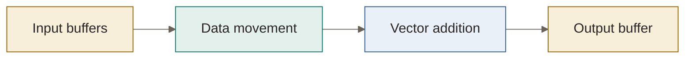

<!-- Generated by npm run style. Copy the block and replace nodes for a new diagram. -->

```mermaid
---
config:
  theme: base
  themeVariables:
    background: '#FAF8F4'
    primaryColor: '#E4F0EB'
    primaryTextColor: '#292524'
    primaryBorderColor: '#0F766E'
    lineColor: '#6B635A'
    fontFamily: 'system-ui, sans-serif'
---
flowchart LR
    input[Input buffers]:::memory --> transfer[Data movement]:::communication
    transfer --> compute[Vector addition]:::compute
    compute --> output[Output buffer]:::memory
    classDef compute fill:#EAF0F8,stroke:#315C8C,color:#292524
    classDef memory fill:#F8EFDA,stroke:#9A6700,color:#292524
    classDef communication fill:#E4F0EB,stroke:#0F766E,color:#292524
    classDef warning fill:#F9E7E3,stroke:#B54735,color:#292524
```
