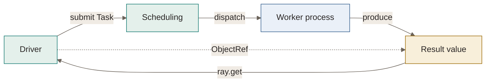
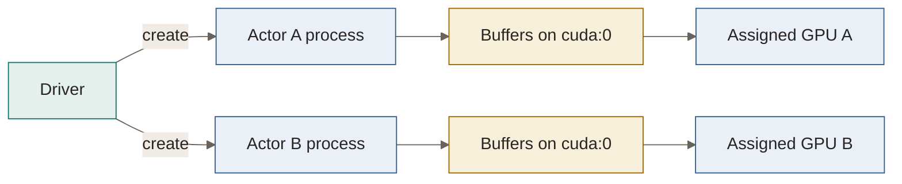

# Ray：Task、ObjectRef、Actor 与 CPU/GPU 资源

**状态：来源核查后的教学讲解与实验骨架；CPU/GPU 实验未运行。** 下面的解释来自官方资料与示例代码，不是学习者自己的复述，也没有服务器性能实测。

[运行时分类](../README.md) · [主题索引](../../README.md) · [问题清单](../../../GAPS.md)

## 要解释的问题

当 Python 程序需要把许多工作交给不同进程，甚至不同机器时，谁决定工作在哪里执行？调用方怎样等结果，执行进程怎样保留状态，GPU 怎样分配？Ray Core 提供 Task、ObjectRef、Actor 与资源调度，把这些机制组合成可编排的执行程序。[官方概念入口](https://docs.ray.io/en/latest/ray-core/key-concepts.html)

本页从单节点开始，先看提交和等待，再看依赖、状态和并发，最后观察 GPU 分配。你的服务器配置为**双卡 RTX6000 Pro、96 核 CPU（用户自述，未检测）**；具体型号、可见资源、显存、驱动与 CUDA 信息由实际运行记录。默认只声明 4 个逻辑 CPU，不需要一开始用满机器。

先修可以按需回顾 Python 函数与类、独立进程的地址空间、future、线程和 `asyncio`。Ray Core 的入门不依赖先学完 PPO 或 GRPO。

(ray-tasks)=
## 1 · Task 与 ObjectRef：提交和等待是两件事

普通函数调用在当前进程执行，返回时得到函数结果。把函数交给 Ray 后，`.remote()` 提交一次 Task，返回用于引用结果的 `ObjectRef`；执行由 worker 进程承担，结果此时可能尚未就绪。`ray.get(ref)` 在需要结果的位置等待并取回值；执行失败也会在取回结果时传播异常。[Tasks](https://docs.ray.io/en/latest/ray-core/tasks.html)

```python
import ray

ray.init(address="local", num_cpus=4, num_gpus=0)

@ray.remote(num_cpus=1)
def square(x):
    return x * x

ref = square.remote(3)  # ObjectRef，结果可能还没有产生
value = ray.get(ref)    # 等待结果；成功时 value 为 9
ray.shutdown()
```

这段代码说明 API 语义；完整实验使用下方脚本，保存实际观察。Task 可以运行在同机其他进程，也可以调度到集群中的其他节点；`.remote()` 不表示一定跨机器。多个 Task 可以复用 worker，不能把每个 Task 等同于一个新进程。



图：Task 提交与结果取回的教学模型。实线表示控制或数据流，虚线表示引用关系；调度被简化成一个节点，省略内部组件、序列化、网络与对象存储细节，也不表示集中式全局调度器。

考虑下面两种程序，先预测哪一种允许多个工作同时在途：

```python
# 每次都等上一个工作完成，才提交下一个。
values_a = [ray.get(square.remote(i)) for i in range(8)]

# 先提交，再取回结果；执行并发度仍由资源和依赖决定。
refs = [square.remote(i) for i in range(8)]
values_b = ray.get(refs)
```

第一种写法在每次提交后阻塞 driver；第二种给调度器留下了多个可执行工作。两者结果可以相同，提交与等待形成的时间关系不同。即使第二种允许并发，任务过小、启动或序列化成本也可能使总耗时更大，不能仅凭使用 Ray 推断加速。[循环中调用 get](https://docs.ray.io/en/latest/ray-core/patterns/ray-get-loop.html) · [过细粒度任务](https://docs.ray.io/en/latest/ray-core/patterns/too-fine-grained-tasks.html)

(ray-objects)=
## 2 · 对象与依赖：引用怎样连接计算

`ObjectRef` 引用一个 Ray 对象；Task 的返回值和 `ray.put(value)` 都能产生引用。传给 Task 的**顶层 ObjectRef 参数**会建立依赖，调用函数时参数已解析为对应值，因此可以把生产者与消费者直接连接起来，无需 driver 先取回中间结果。[Objects](https://docs.ray.io/en/latest/ray-core/objects.html)

```python
@ray.remote(num_cpus=1)
def plus_one(value):
    return value + 1

producer = square.remote(3)
consumer = plus_one.remote(producer)
answer = ray.get(consumer)  # 成功时为 10
```

这里讨论顶层参数；引用嵌套在列表或字典中时，不能直接套用自动解析规则。Ray 对象按不可变对象理解；对象的存储、拷贝和序列化成本依赖大小、类型与节点位置，也不能把所有 Python 对象都解释成零拷贝共享内存。

`ray.put()` 可让多个消费者引用同一个输入，避免反复按值提交大对象。它不消除跨节点数据传输，也不代替对数据生命周期的考虑。[重复传递大参数](https://docs.ray.io/en/latest/ray-core/patterns/pass-large-arg-by-value.html)

`ray.wait(refs, num_returns=...)` 返回已就绪与剩余的**引用**，不是结果值。CPU 实验用它把未收集工作数限制为 3，实现提交侧背压。控制在途工作数与控制运行并发度是不同机制：前者约束提交队列，后者主要由任务资源要求与可用资源决定。[在途任务限制](https://docs.ray.io/en/latest/ray-core/patterns/limit-pending-tasks.html)

(ray-actors)=
## 3 · Actor：保留进程内状态

当工作要复用模型、缓存或计数器时，只提交独立函数还不够。`@ray.remote` 修饰类后，创建 Actor 会建立持久 worker 进程，在其中保留实例。`actor.method.remote()` 提交该实例的方法调用，并返回结果引用。[Actors](https://docs.ray.io/en/latest/ray-core/actors.html)

默认同步 Actor 按串行方式执行方法。CPU 实验从同一个 driver 连续调用计数器，验证结果依次为 1、2、3，并记录三次调用所在的 PID。这个顺序依赖本例的默认同步 Actor、单一提交者和成功执行，不能泛化为所有 Actor 配置的全局顺序。[Actor 执行顺序](https://docs.ray.io/en/latest/ray-core/actors/task-orders.html)

Actor 的状态存在于执行它的进程中。它适合重复使用资源，但不自动提供外部持久存储、重启后的状态恢复或副作用的 exactly-once 保证。实际故障恢复需要结合重启、重试与 checkpoint 语义。[Actor fault tolerance](https://docs.ray.io/en/latest/ray-core/fault_tolerance/actors.html)

本页所有 Actor 都显式声明 `num_cpus=1`。默认 Actor 的 CPU 调度与运行资源行为有历史差异，教学代码使用明确声明便于观察资源持有。[Resources](https://docs.ray.io/en/latest/ray-core/scheduling/resources.html)

(ray-concurrency)=
## 4 · 进程、线程、协程：并发发生在哪一层

| 执行方式 | 状态与执行位置 | 等待怎样组织 | 关键前提 |
| --- | --- | --- | --- |
| 多个 Task／Actor 进程 | 各进程有自己的地址空间 | 不同进程可以分别推进工作 | 需要可用资源；进程间通信有成本 |
| 默认同步 Actor | 同一实例与进程 | 一个方法完成后执行下一个 | 不主动开启方法并发 |
| Threaded Actor | 同一进程中的线程池共享状态 | 不同线程可交叠等待 | 显式 `max_concurrency`；共享状态需要同步 |
| Async Actor | 同一进程、单线程事件循环共享状态 | 在 `await` 处让出执行 | 使用真正可让出的等待；阻塞操作会卡住事件循环 |

CPU 脚本用 `time.sleep(0.15)` 模拟同步等待，用 `await asyncio.sleep(0.15)` 模拟异步等待；两者是**教学延迟**。线程与协程的并发上限均设为 2，观察 PID、线程 ID 与开始/结束事件，而不是把等待实验当作 CPU 算力测试。[Actor concurrency](https://docs.ray.io/en/latest/ray-core/actors/async_api.html)

在传统、启用 GIL 的 CPython 中，增加同一进程中的线程不保证纯 Python 计算并行；部分原生计算库释放 GIL，行为另当别论。Async Actor 的方法也不会仅因写成 `async def` 就同时执行 CPU 计算：必须在合适的 `await` 处让出执行。其内部不应使用阻塞式 `ray.get()`／`ray.wait()`；等待引用应使用异步机制。[Async Actor pattern](https://docs.ray.io/en/latest/ray-core/patterns/concurrent-operations-async-actor.html)

并发 Actor 的共享状态需要明确保护。线程示例用 `threading.Lock`；异步示例用 `asyncio.Lock` 保护状态更新，等待发生在锁外。若一次“读取 → 等待 → 写回”跨越 `await`，不同调用可能读取同一个旧值，产生丢失更新。默认串行 Actor 的直觉不能直接用于这种配置。

(ray-resources)=
## 5 · CPU／GPU 资源：谁分配，谁计算

`num_cpus` 与 `num_gpus` 表达 Ray 调度所需的**逻辑资源数量**。`num_cpus=1` 不会把工作自动绑定到某个物理核，也不阻止库启动更多线程。脚本默认声明 4 个逻辑 CPU，是教学用的准入容量；真实线程与进程的执行仍由操作系统及库决定。[资源模型](https://docs.ray.io/en/latest/ray-core/scheduling/resources.html)

GPU Task／Actor 声明 `num_gpus=1` 后，Ray 分配 GPU 资源并设置设备可见性；真正的张量计算由 PyTorch/CUDA 执行。申请两张 GPU 也不会自动把一个算子或模型拆成模型并行；这需要工作负载自己的并行实现。资源声明同样不是显存配额。[GPU assignment](https://docs.ray.io/en/latest/ray-core/scheduling/accelerators.html)



图：假设两个 Actor 各持有一张不同 GPU。每个进程只看到自己的设备，所以两边的本地编号都可以是 `cuda:0`。这不是实测分配；脚本同时记录 Ray GPU ID、`CUDA_VISIBLE_DEVICES` 和 PyTorch 本地编号，以实际记录解释映射。Ray GPU ID 也不应未经核对就当作 `nvidia-smi` 的物理编号，尤其是已有可见设备掩码时。

### 与其他 AI 系统的连接

| 系统 | 关注的职责 | 材料入口 |
| --- | --- | --- |
| Ray Core | Task、Actor、依赖与资源编排 | 本页 |
| NCCL／PyTorch distributed | rank 间的张量通信与训练同步 | [通信与分布式训练](../../distributed-training/README.md) |
| vLLM | 生成请求、KV Cache 与模型执行的调度 | [推理服务](../../inference-serving/README.md) |
| verl | 把训练、rollout、评分等角色接成后训练系统；具体组织按版本追踪 | [14.7 角色与资源](../../../paths/ai-infra/14-post-training-rlhf.md#ai-14-7) |

这些层可以组合。这里先建立职责边界，尚未追踪特定版本的 verl/vLLM 执行路径；Ray Actor 是执行机制，PPO 中的 actor 是 policy 角色，两种用词需要结合上下文。[verl 官方入口](https://verl.readthedocs.io/en/latest/)

(ray-labs)=
## 实验骨架：先预测，再在服务器运行

**两类实验都已保存代码，但均未运行。** 默认从服务器上的仓库根目录执行。

| 用例 | 代码行为与验收 | 运行前预测 |
| --- | --- | --- |
| CPU `tasks` | 8 个平方任务，两种提交/等待方式；核对数值并保存事件与耗时 | 哪些任务的执行区间能够重叠？ |
| CPU `objects` | 两个消费者读取 `ray.put()` 输入；生产者依赖；`ray.wait()` 限制 3 个在途工作 | 消费者何时才能执行？3 个在途工作与 4 个 CPU 有何关系？ |
| CPU `actor` | 同一 Actor 三次计数，核对 1、2、3 和 PID | driver 的普通变量会被同步修改吗？ |
| CPU `concurrency` | 同步串行、2 线程、2 协程；各执行 4 次教学等待 | PID、线程 ID、开始/结束事件分别会怎样？ |
| GPU `task` | 一张 GPU 执行 4096 元素 FP32 向量加法，与 CPU 期望值精确核对 | 哪个进程计算，哪个进程拿结果？ |
| GPU `actors` | 两个 Actor 各保留一张 GPU 与缓冲区，各调用两轮 | 为什么两边的 `cuda:0` 可以对应不同 GPU？计数为何继续增长？ |

### 环境与依赖

建议 Python 3.11；CPU 环境只安装主题自己的 Ray 依赖。所有示例行为按 Ray 2.59.0 官方文档核查，日期为 **2026-10-02**。

```bash
# 在远程服务器的仓库根目录
python3.11 -m venv .venv-ray
.venv-ray/bin/python -m pip install -r topics/distributed-runtime/ray/requirements.txt
.venv-ray/bin/python topics/distributed-runtime/ray/cpu_experiments.py --help
```

GPU 脚本使用服务器中已有、支持这两张 GPU 的 CUDA 版 PyTorch。在对应环境中安装同一份 Ray 依赖；需要新装 PyTorch 时，依据服务器驱动与官方安装说明准备，网站和本地文档环境不安装 GPU 栈。[PyTorch 安装](https://pytorch.org/get-started/locally/)

```bash
# 以下 python 指服务器已有的 PyTorch 环境
python -m pip install -r topics/distributed-runtime/ray/requirements.txt
nvidia-smi
python -c 'import torch; print(torch.__version__, torch.version.cuda, torch.cuda.is_available(), torch.cuda.device_count())'
python topics/distributed-runtime/ray/gpu_experiments.py --help
```

CUDA wheel 与 GPU 的兼容性仍需通过实际张量运算验证；设备可以被枚举不等于 kernel 一定能执行。脚本会核对向量加法并保存运行失败。

### 运行命令

先写下上表的预测，再运行对应单元；`--case all` 可以一次完成该脚本的全部用例。

```bash
.venv-ray/bin/python topics/distributed-runtime/ray/cpu_experiments.py \
  --case tasks --num-cpus 4 --output .runs/ray-cpu-tasks-first

.venv-ray/bin/python topics/distributed-runtime/ray/cpu_experiments.py \
  --case all --num-cpus 4 --output .runs/ray-cpu-all-first

# 在已有 CUDA 版 PyTorch 环境运行
python topics/distributed-runtime/ray/gpu_experiments.py \
  --case task --num-cpus 4 --output .runs/ray-gpu-task-first

python topics/distributed-runtime/ray/gpu_experiments.py \
  --case actors --num-cpus 4 --output .runs/ray-gpu-actors-first
```

输出目录必须是新目录，防止覆盖前次记录；省略 `--output` 会生成 `.runs/ray-cpu/<UTC 时间>/` 或 `.runs/ray-gpu/<UTC 时间>/`。CPU 用例启动独立的单节点运行时并声明 0 个 GPU；GPU 用例由 Ray 自动检测可见 GPU，不虚报设备数量。双 Actor 用例要求至少 2 个逻辑 CPU 和 2 张可见 GPU；数量不足会在提交前报错。两类运行时都使用 128 MiB 对象存储作为教学容量，并将主题源码目录提供给 worker，以便导入共享记录函数。

脚本使用 120 秒的结果等待上限；远程冷启动或环境异常导致超时会保存失败，不转写成性能结论。每个脚本结束时关闭自己创建的运行时，Actor 用例释放所创建的 Actor。

### 怎样读记录

每次运行生成 `run.json`，记录实际环境、命令、参数、Git revision 与未提交文件列表、逻辑资源、用例结果和时间事件。GPU 记录还包含 PyTorch/CUDA build、`nvidia-smi` 设备信息以及 worker 的设备映射。依赖导入或输出目录创建之前的失败发生在记录建立前，需要保留终端错误。

`status: passed` 表示本次脚本中的数值和状态检查通过；不表示模型性能或个人理解已经验证。运行期间的异常保存类型、信息与 traceback，并以失败退出。

时间使用同节点进程可比较的 `time.perf_counter_ns()`。CPU 的 driver 耗时包含冷启动、调度与等待；只观察执行区间，不断言并行一定更快。GPU 事件在 `torch.cuda.synchronize()` 后记录完成，另存 CPU 数值核对完成事件；它们不是 CUDA Events 测得的纯 kernel 时间。本例向量很小，用途是验证资源分配与正确性，不能比较两张卡的算力。

主笔记中的所有数值参数都是教学参数；远程实验的原始计时才是实际观察。需要性能结论时，应另设稳定负载、预热与重复测量，并记录同步、缓存和测量开销。

### 回收结果

在本机仓库根目录，用实际 SSH 主机名和远程路径替换下面的示例：

```bash
mkdir -p .runs/from-ray-server-first
rsync -av gpu-box:~/ai-infra-learning/.runs/ray-cpu-all-first/ .runs/from-ray-server-first/cpu/
rsync -av gpu-box:~/ai-infra-learning/.runs/ray-gpu-actors-first/ .runs/from-ray-server-first/gpu/
```

如果服务器修改了脚本，先把主题目录取回新的临时目录，比较源码差异后再合并。挑选真实记录放入主题 `results/`，把预测、观察、解释修正和限制简要补回本页；原始大日志继续留在 `.runs/`。

## 复述与后续问题

先解释第一单元：`.remote()` 返回的是什么，计算发生在哪里，`ray.get()` 改变了 driver 的什么行为？再从实际记录核查自己的解释。

下一单元可以检验：顶层引用怎样建立依赖；默认 Actor 的串行状态模型何时失效；逻辑资源怎样约束提交；GPU 编号怎样映射。跨节点传输、Placement Group 和特定 verl 版本的角色编排在后续实际需要时展开。候选问题进入 [GAPS](../../../GAPS.md)，保持“待诊断”状态。

## 来源与版本

- [Ray Core concepts](https://docs.ray.io/en/latest/ray-core/key-concepts.html)、[Tasks](https://docs.ray.io/en/latest/ray-core/tasks.html)、[Objects](https://docs.ray.io/en/latest/ray-core/objects.html)：基础 API 与依赖语义。
- [Actors](https://docs.ray.io/en/latest/ray-core/actors.html)、[Actor concurrency](https://docs.ray.io/en/latest/ray-core/actors/async_api.html)、[Task orders](https://docs.ray.io/en/latest/ray-core/actors/task-orders.html)：进程、状态与并发行为。
- [Resources](https://docs.ray.io/en/latest/ray-core/scheduling/resources.html)、[Accelerators](https://docs.ray.io/en/latest/ray-core/scheduling/accelerators.html)：逻辑资源与 GPU 可见性。
- [提供的视频](https://www.bilibili.com/video/BV1HuZcBEEyy/)：标题与简介已核查，主题为 Ray Task／Actor、调度与并发；正文、字幕及简介中的私有代码未读取，本页不作为视频逐段总结。

Ray 资料核查版本为 2.59.0，查阅日期 2026-10-02。官方 `latest` 链接后续可能变化；重跑时以 `run.json` 中记录的安装版本为准。GPU 实验的 PyTorch、CUDA、驱动版本以服务器实际记录为准。
